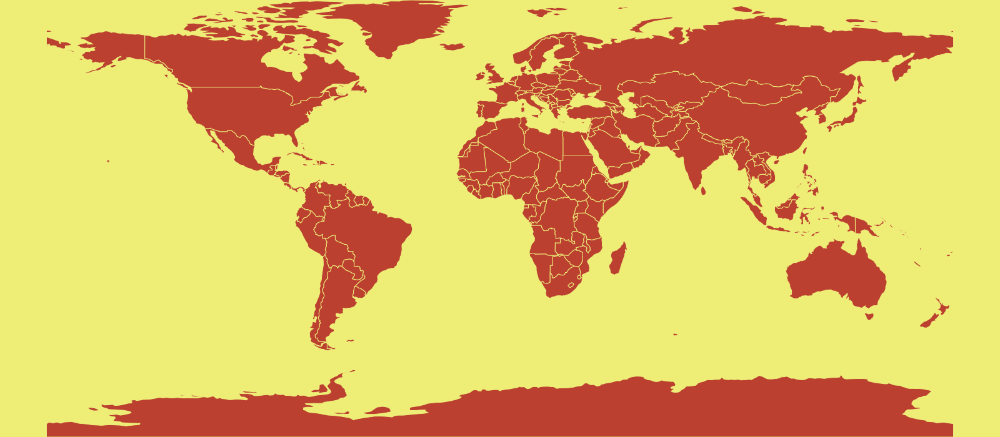

# Mapnik-jenerat
*Generating maps in C++ using Mapnik.*

  

> This repository is a draft used for preliminary tests for a larger project. It isn't aimed for any real use besides experimenting map generation.